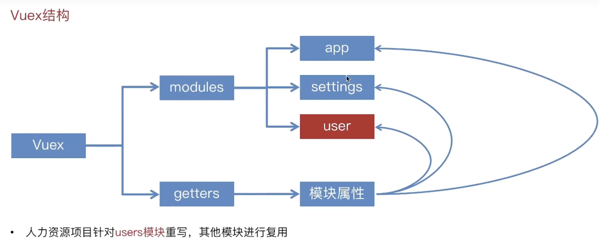
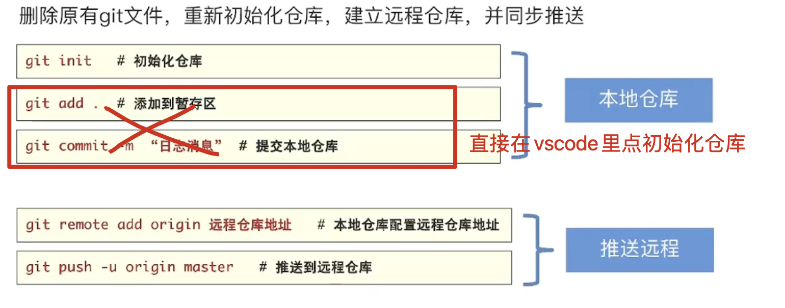
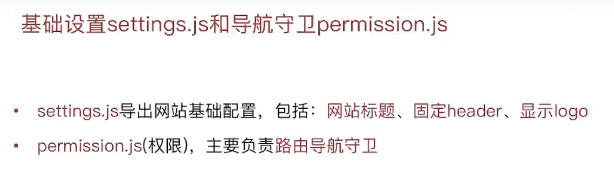
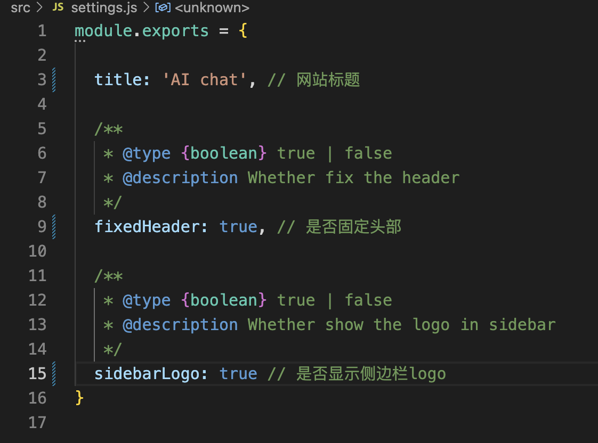
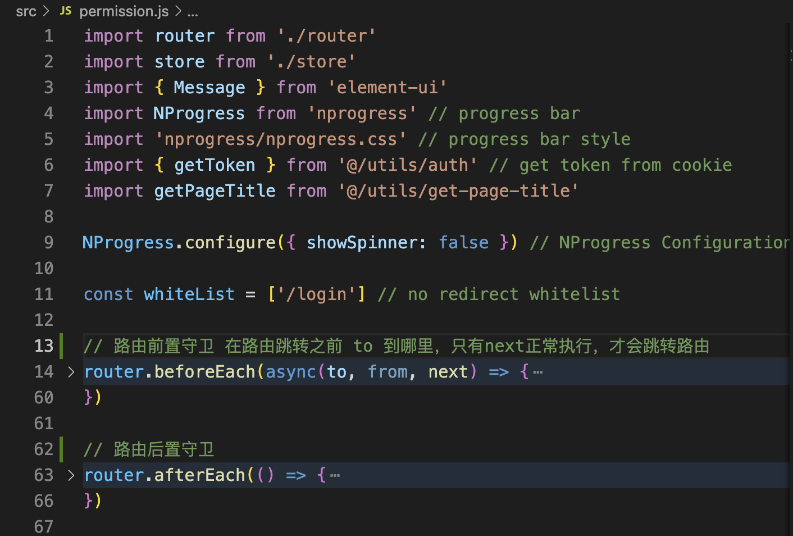
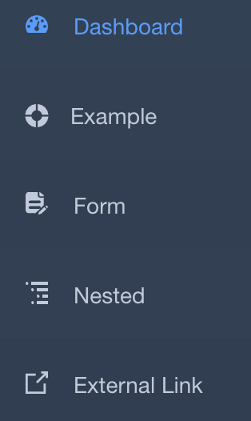
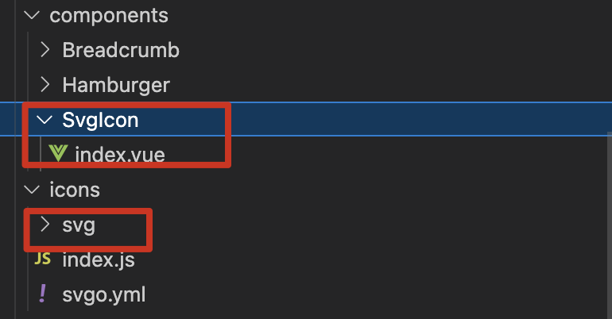
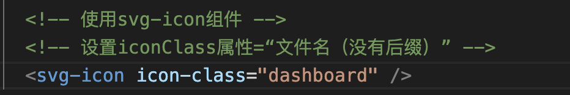
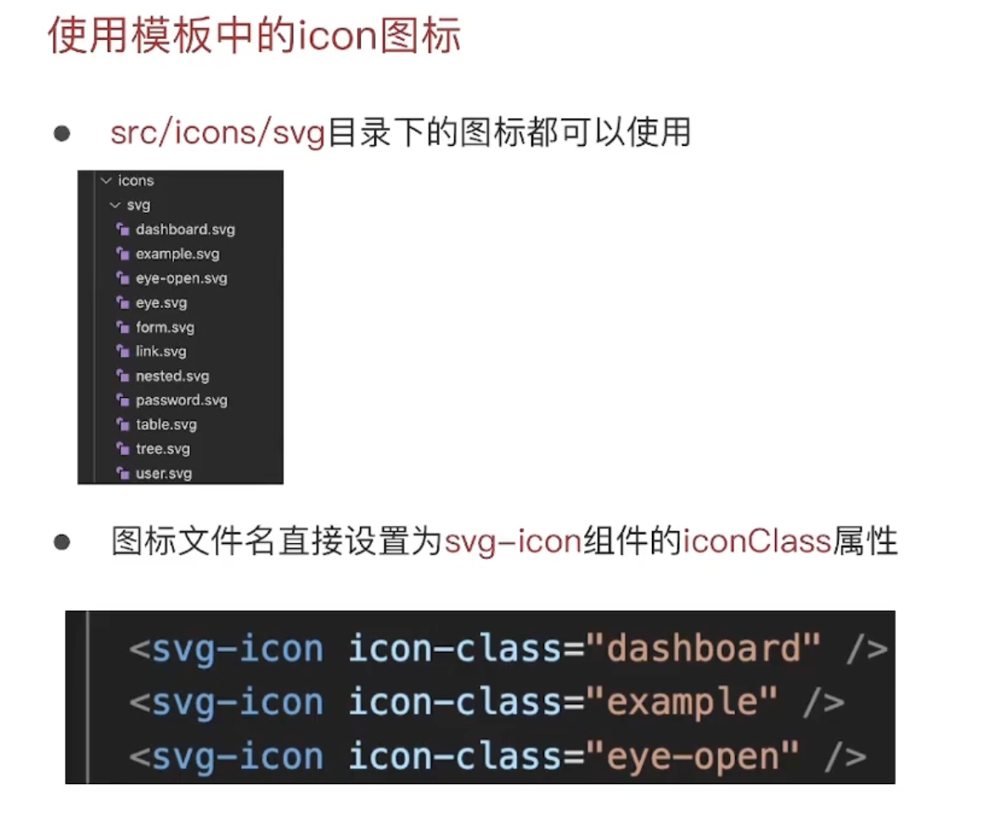
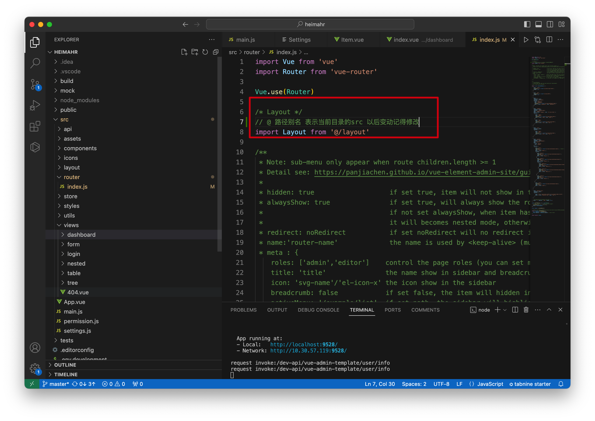

**如果对变更文件目录结构、文件部署有问题的可以参照此文档**


# 项目简介

## 下载依赖

### 前端

先进入前端

```
cd front
```

在终端输入如下命令下载依赖

```
npm install
```

启动前端

```
npm run dev
或者
yarn dev（但是这个我没成功）
```

### 后端

进入后端
```
cd back
```
在终端输入如下命令启动后端
```
mvn spring-boot:run
```


## Vuex

### 结构



### 设计思想


## git管理



## setting.js和permission.js







## icon

### svg图标



svgicon+svg图标即可显示




### 设置svg-icon方法



只要把svg文件拖入svg目录下即可



## Utils文件夹

放公用文件函数

# 路径问题

## Src/router/index.js文件

修改为../layout

*后续因分开前后端，这里不需要修改，如果是@也无所谓



# 待完成的工作

## 项目logo

设计UI，插入左侧栏，logo图片放入assets/common下

## 页面获取数据

等后端封装完数据之后，就不用样例数据了，具体教程看[这个](https://www.bilibili.com/video/BV1Te411X7Wz/?p=42&spm_id_from=pageDriver&vd_source=211c68fed6443485e46395a3663fc0a6)

