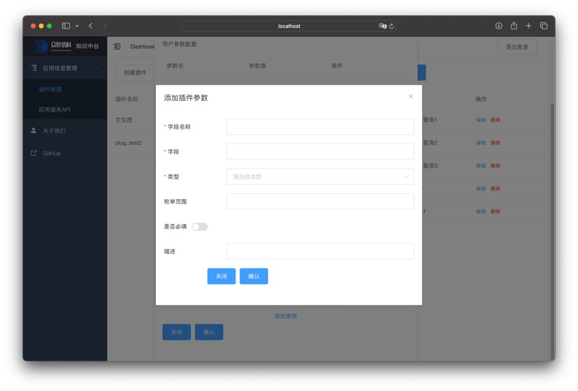

# 项目简介

## 下载依赖

### 前端

先进入前端

```
cd front
```

在终端输入如下命令下载依赖

```
npm install
```

启动前端

```
npm run dev
```

### 后端

进入后端
```
cd back
```
在终端输入如下命令启动后端
```
mvn spring-boot:run
```

# 成员分工

徐迟：插件和函数管理前端

严梦婷：问答接口和应用服务后端

张梦芮：应用服务前端和问答应用前后端

廖锟鹏：插件和函数管理后端

# 已完成的工作

## 前端
1. 插件和函数部分页面实现效果
2. 应用服务API部分页面实现效果
3. 问答应用部分页面实现效果

### 插件

- 插件管理                


- 新增插件


-  编辑插件


- 配置插件


- 新增用户参数


- 添加插件参数



### 函数

- 根据名字查询


- 新建函数


- 编辑函数


### 应用服务API
- 新建API

- 查看API

- 删除API

- 新建参数

- 删除参数

- 查询API

### 问答应用
- 新建对话

- 编辑对话名称

- 展示名片

- 问答

- 插件

### 后端
主要为问答接口实现效果
- 天气预报查询

- 查询快递状态

- 查询银行货币汇率


插件和函数管理后端部分代码展示
- 插件模块controller


